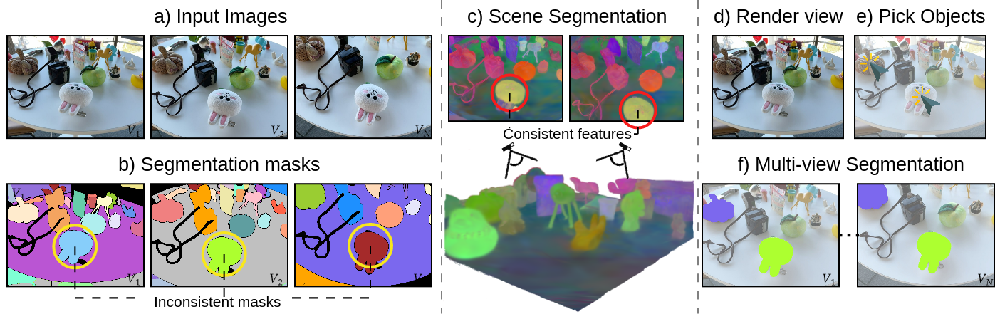

# Contrastive Gaussian Clustering

This repository contains the implementation associated with the paper "Contrastive Gaussian Clustering: Weakly Supervised 3D Scene Segmentation", click in the next link for more details.

>[**Contrastive Gaussian Clustering: Weakly Supervised 3D Scene Segmentation**](https://arxiv.org/abs/2404.12784)
>Myrna C. Silva, Mahtab Dahaghin, Matteo Toso,  Alessio Del Bue
>Istituto Italiano di Tecnologia - IIT



## Standard Installation
Clone the repository locally
```bash
git clone https://github.com/lkeab/gaussian-grouping.git
cd contrastive-gaussian-clustering
```
We provide a conda environment setup file including all the dependencies. Create the conda environment `contrastive-gaussian` by running:
```bash
conda create -n contrastive-gaussian python=3.11 -y
conda activate contrastive-gaussian

pip install pytorch==2.3.0  torchvision==0.18.0  torchaudio==2.3.0
pip install plyfile==1.0.3
pip install tqdm scipy wandb opencv-python scikit-learn lpips

pip install submodules/diff-gaussian-rasterization
pip install submodules/simple-knn
```
You will also need the the GroundingDINO (and SAM) set up to select an object by text:
```bash

```
