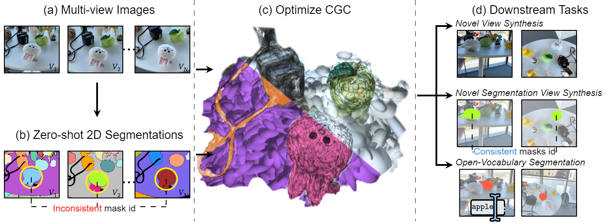

# Contrastive Gaussian Clustering

This repository contains the implementation associated with the paper "Contrastive Gaussian Clustering: Weakly Supervised 3D Scene Segmentation", click in the next link for more details.

>[**Contrastive Gaussian Clustering: Weakly Supervised 3D Scene Segmentation**](https://arxiv.org/abs/2404.12784)<br />
>Myrna C. Silva, Mahtab Dahaghin, Matteo Toso,  Alessio Del Bue<br />
>Istituto Italiano di Tecnologia - IIT



## Standard Installation
Clone the repository locally
```bash
git clone https://github.com/MyrnaCCS/contrastive-gaussian-clustering.git
cd contrastive-gaussian-clustering
```
We provide a conda environment setup file including all the dependencies. Create the conda environment `contrastive-gaussian` by running:
```bash
conda create -n contrastive-gaussian python=3.11 -y
conda activate contrastive-gaussian

pip install pytorch==2.3.0  torchvision==0.18.0  torchaudio==2.3.0
pip install plyfile==1.0.3
pip install tqdm scipy wandb opencv-python scikit-learn lpips

pip install submodules/diff-gaussian-rasterization
pip install submodules/simple-knn
```

## Optimizing a CGC
To optimize a Contrastive Gaussian Clustering model:
```bash
python train.py -s <path to COLMAP or NeRF Synthetic dataset> -m <path where the trained model should be stored>
```

## Rendering a CGC
To render a Contrastive Gaussian Clustering model:
```bash
python train.py -m <path to trained model>
```

## ToDo List
- [x] release the code to preprocess multi-view images
- [x] release the code for open-vocabulary segmentation
- [x] release the evaluation code
- [x] release the preprocessed dataset and the pretrained model
- [x] release the code for 3D object segmentation

## Citation
<section class="section" id="BibTeX">
  <div class="container is-max-desktop content">
    <h2 class="title">BibTeX</h2>
    <pre><code>@Article{contrastive_gaussians_2024,
      author       = {Myrna C. Silva and Mahtab Dahaghin and Matteo Toso and Alessio Del Bue},
      title        = {Contrastive Gaussian Clustering: Weakly Supervised 3D Scene Segmentation},
      journal      = {https://arxiv.org/abs/2404.12784},
      year         = {2024}
}</code></pre>
  </div>
</section>

## Thanks
This code is based on [3D Gaussian Splatting](https://github.com/graphdeco-inria/gaussian-splatting) and [Gaussian Grouping](https://github.com/lkeab/gaussian-grouping/tree/main) codebases. We thank the authors for releasing their code.
